<div align="center">

# 📚 P.ustaka
### Sistem Informasi Perpustakaan Digital Sekolah

> 🎓 **Proyek UKK (Uji Kompetensi Keahlian) — SMK Jurusan PPLG**  
> Dibuat sebagai syarat kelulusan Uji Kompetensi Keahlian (UKK) Tahun Ajaran 2025/2026

[](https://laravel.com)
[](https://react.dev)
[](https://inertiajs.com)
[](https://tailwindcss.com)
[](https://php.net)
[]()

**P.ustaka** adalah sistem informasi perpustakaan sekolah berbasis web yang modern, dirancang untuk mempermudah pengelolaan koleksi buku, keanggotaan siswa, transaksi peminjaman & pengembalian, manajemen denda, dan pelaporan secara digital.

</div>

---

## 🖼️ Tampilan Aplikasi

### 🏠 Landing Page & Autentikasi
| Landing Page | Login | Register |
|:---:|:---:|:---:|
| 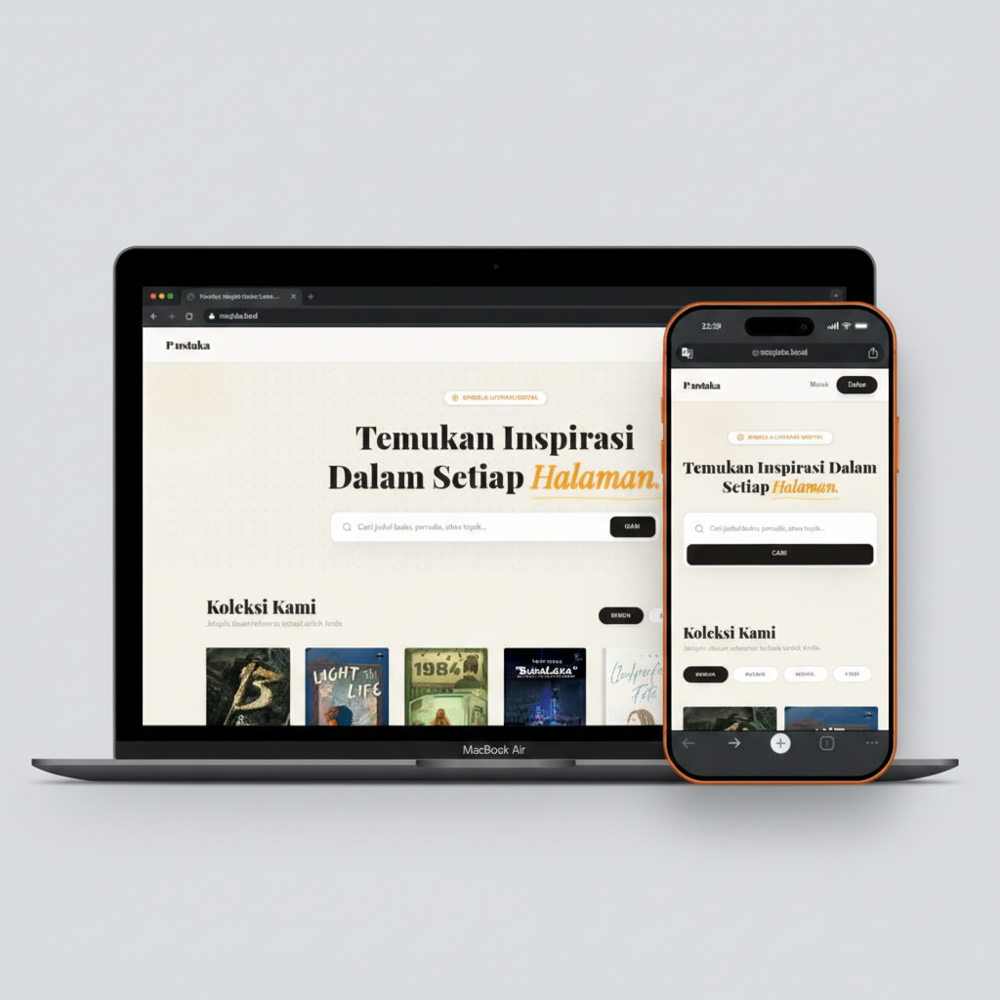 | 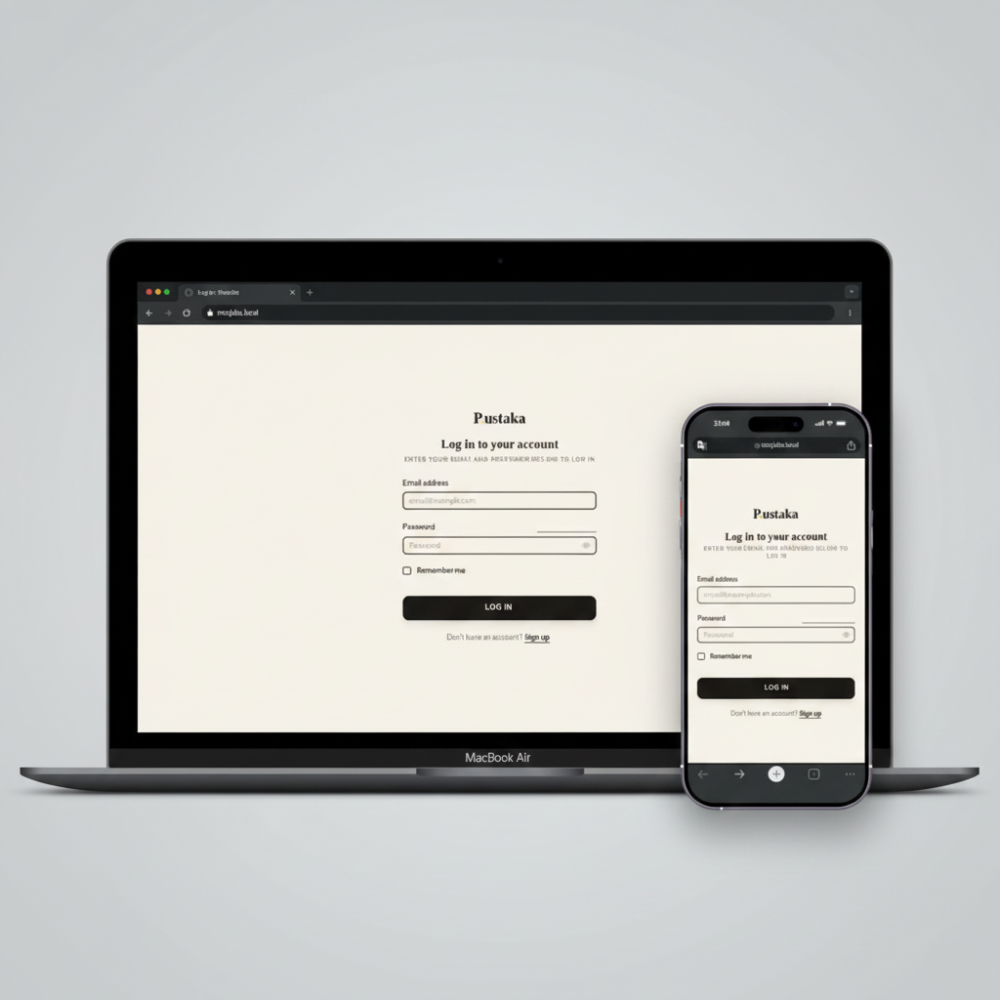 | 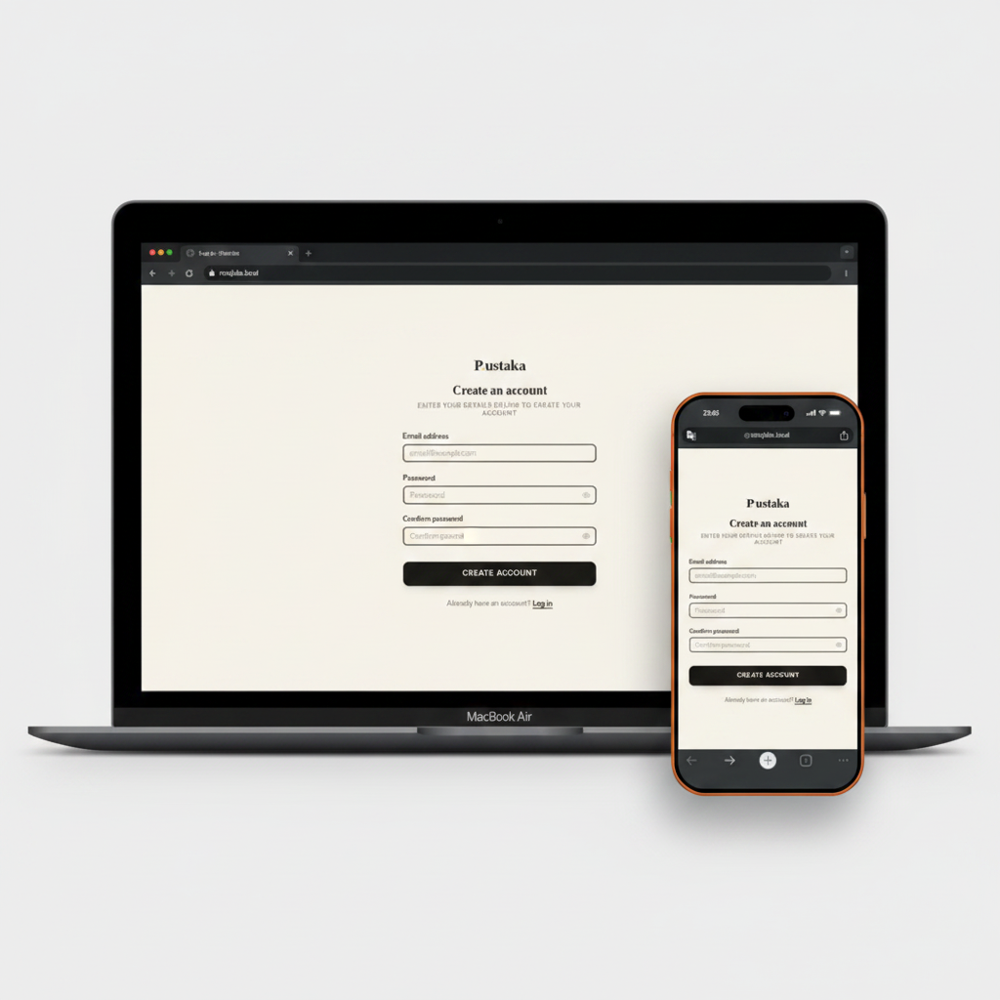 |

| Verifikasi OTP | Data Diri |
|:---:|:---:|
| 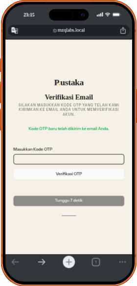 | 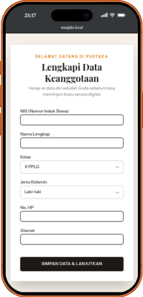 |

### 👤 Tampilan Pengguna (Siswa)
| Katalog Buku | Detail Buku | Profil User |
|:---:|:---:|:---:|
| 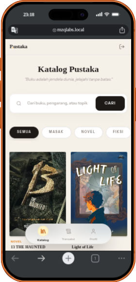 | 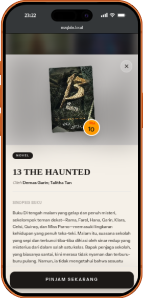 | 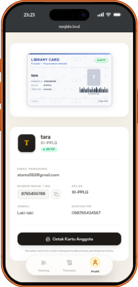 |

| Histori Transaksi |
|:---:|
| 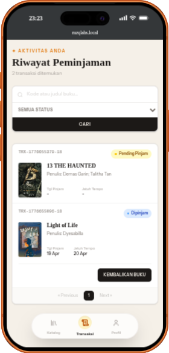 |

### 🛠️ Panel Admin
| Dashboard Admin | CRUD Buku | CRUD & Cetak Anggota |
|:---:|:---:|:---:|
| 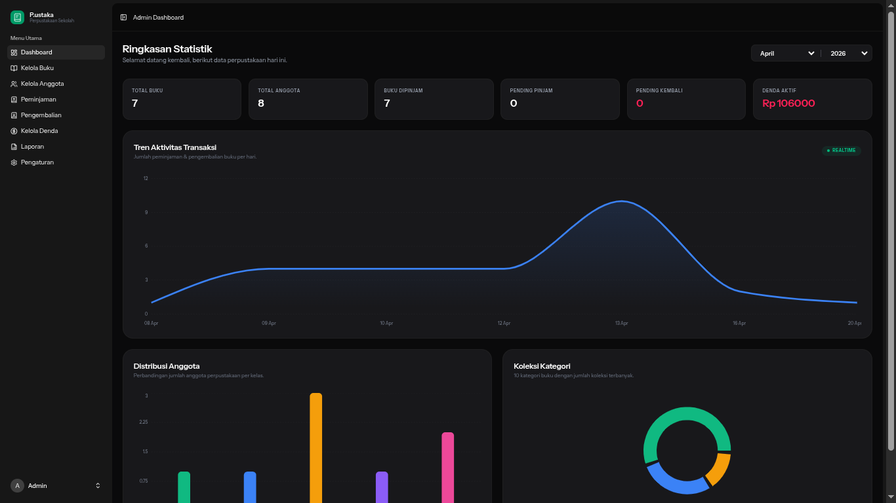 | 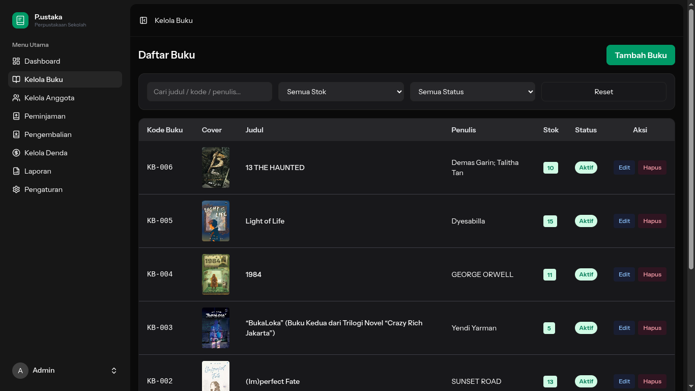 | 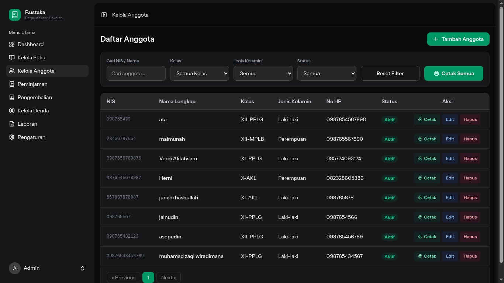 |

| Verifikasi Peminjaman | Verifikasi Pengembalian | Kelola Denda |
|:---:|:---:|:---:|
| 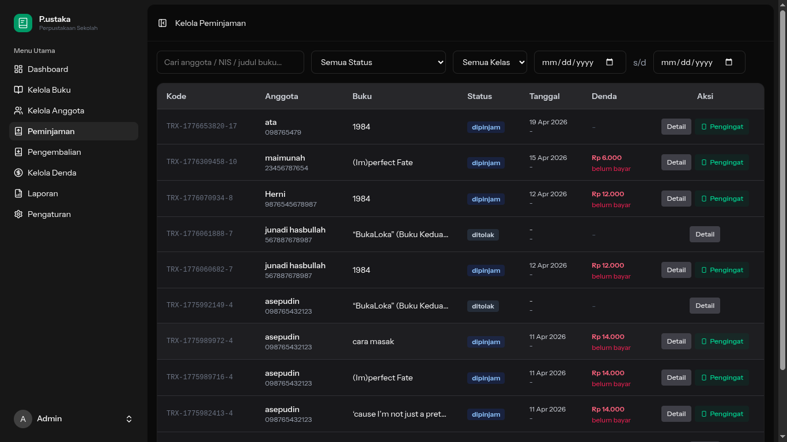 | 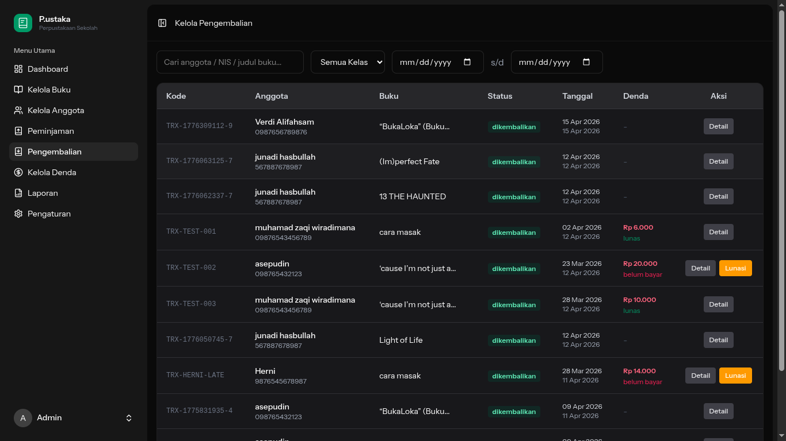 | 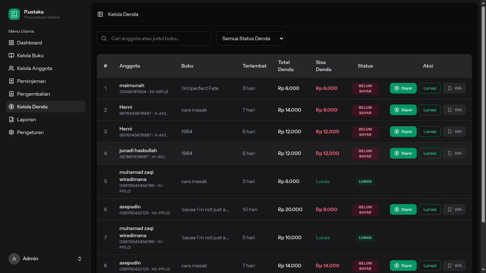 |

| Cetak Laporan | Hasil Cetak Laporan | Setting Jatuh Tempo & Denda |
|:---:|:---:|:---:|
| 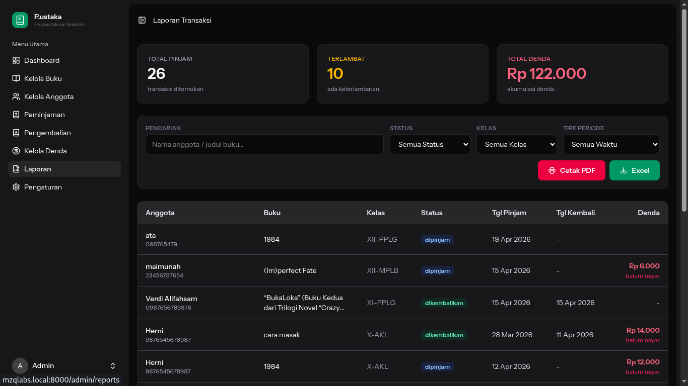 | 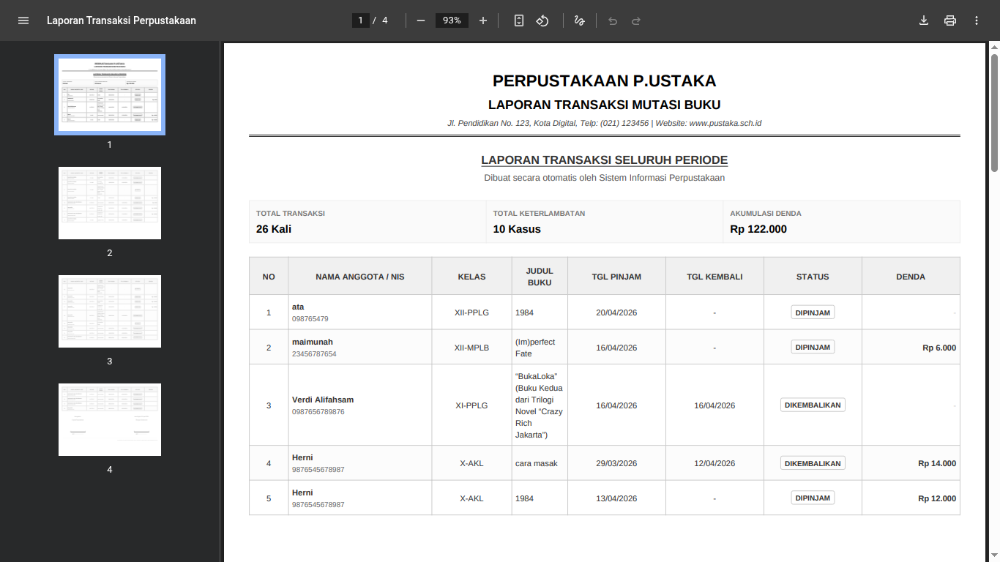 | 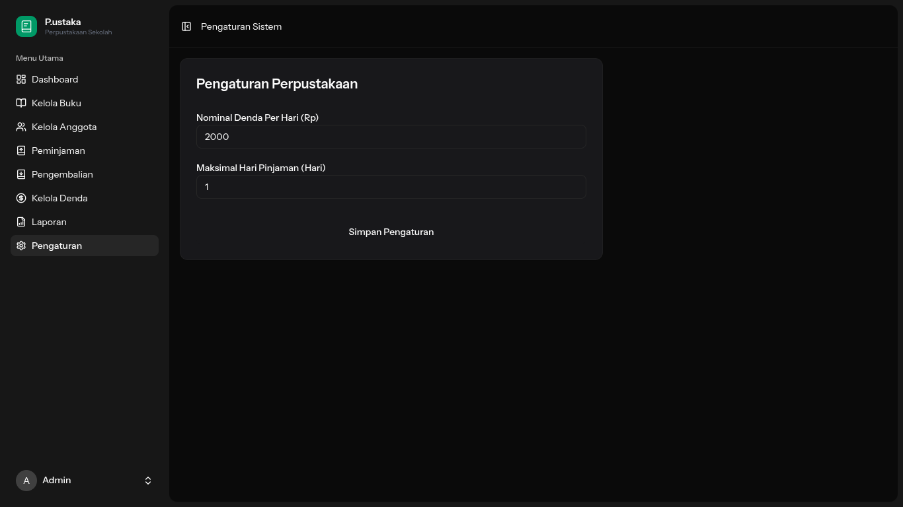 |

---

## ✨ Fitur Utama

### 👨‍💼 Admin
- **Dashboard Interaktif** — Statistik real-time dengan grafik transaksi, distribusi anggota, dan koleksi buku
- **Manajemen Buku** — CRUD lengkap dengan upload foto sampul
- **Manajemen Anggota** — CRUD, cetak kartu anggota digital (PDF)
- **Transaksi Peminjaman** — Verifikasi & tolak pengajuan peminjaman dari siswa
- **Transaksi Pengembalian** — Verifikasi pengembalian dengan kalkulasi denda otomatis
- **Manajemen Denda** — Kelola dan tandai pembayaran denda
- **Pengingat WhatsApp** — Notifikasi otomatis via Fonnte API ke anggota yang terlambat
- **Laporan** — Export laporan transaksi ke PDF & Excel dengan filter tanggal
- **Pengaturan** — Konfigurasi denda per hari & batas maksimal hari pinjam

### 👨‍🎓 Siswa / Pengguna
- **Katalog Buku** — Jelajahi semua buku dengan pencarian real-time & filter kategori
- **Detail Buku** — Lihat informasi lengkap & ajukan peminjaman
- **Histori Transaksi** — Pantau status peminjaman aktif & riwayat pengembalian
- **Profil Anggota** — Kelola data diri & kartu anggota digital
- **Notifikasi Flash** — Feedback langsung dari setiap aksi

### 🔐 Autentikasi
- **Login / Register** akun email
- **Verifikasi OTP** via email (Gmail SMTP)
- **Login Google** via OAuth2 (Socialite)
- **Reset Password** dengan OTP
- **Two-Factor Authentication** (TOTP / QR Code)

---

## 🎓 Tentang Proyek

Proyek ini dibuat dalam rangka **Uji Kompetensi Keahlian (UKK)** sebagai salah satu syarat kelulusan bagi siswa SMK Program Keahlian **Pengembangan Perangkat Lunak dan Gim (PPLG)**.

| Info | Detail |
|---|---|
| **Jenis Proyek** | Uji Kompetensi Keahlian (UKK) |
| **Program Keahlian** | Pengembangan Perangkat Lunak dan Gim (PPLG) |
| **Tahun Ajaran** | 2025 / 2026 |
| **Skema** | Rekayasa Perangkat Lunak |

---

## 🛠️ Tech Stack

| Komponen | Teknologi |
|---|---|
| **Backend** | Laravel 13, PHP 8.4 |
| **Frontend** | React 19, Inertia.js v3 |
| **Styling** | Tailwind CSS v4 |
| **Database** | MySQL |
| **Auth** | Laravel Fortify + Google Socialite |
| **Build Tool** | Vite |
| **Testing** | Pest PHP v4 |
| **Notifikasi WA** | Fonnte API |
| **Email** | Gmail SMTP (OTP) |
| **Routing FE** | Laravel Wayfinder |

---

## 📋 Prasyarat

Sebelum instalasi, pastikan sistem Anda memenuhi persyaratan berikut:

- **PHP** >= 8.4
- **Composer** >= 2.x
- **Node.js** >= 22.x & **NPM** >= 9.x
- **MySQL** >= 8.0
- **Git**

---

## 🚀 Instalasi & Setup

### 1. Clone Repository
```bash
git clone https://github.com/username/perpus-app.git
cd perpus-app
```

### 2. Install Dependensi
```bash
# Install PHP dependencies
composer install

# Install Node dependencies
npm install
```

### 3. Konfigurasi Environment
```bash
# Salin file environment
cp .env.example .env

# Generate application key
php artisan key:generate
```

Edit file `.env` dan sesuaikan konfigurasi berikut:
```env
APP_NAME="P.ustaka"
APP_URL=http://localhost:8000

# Database
DB_CONNECTION=mysql
DB_HOST=127.0.0.1
DB_PORT=3306
DB_DATABASE=perpus_app
DB_USERNAME=root
DB_PASSWORD=

# Gmail (untuk OTP Email)
MAIL_MAILER=smtp
MAIL_HOST=smtp.gmail.com
MAIL_PORT=587
MAIL_USERNAME=your_email@gmail.com
MAIL_PASSWORD=your_app_password
MAIL_ENCRYPTION=tls

# Google OAuth
GOOGLE_CLIENT_ID=your_google_client_id
GOOGLE_CLIENT_SECRET=your_google_client_secret
GOOGLE_REDIRECT_URI=http://localhost:8000/auth/google/callback

# WhatsApp Notification (Fonnte)
FONNTE_API_KEY=your_fonnte_api_key
ADMIN_PHONE=628xxxxxxxxxx
```

### 4. Migrasi & Seeding Database
```bash
# Jalankan migrasi
php artisan migrate

# Jalankan seeder (data awal + sample data)
php artisan db:seed
```

### 5. Link Storage
```bash
php artisan storage:link
```

### 6. Build Assets & Jalankan Server
```bash
# Mode development (hot reload)
npm run dev

# Jalankan Laravel server (terminal terpisah)
php artisan serve
```

Akses aplikasi di: **http://localhost:8000**

---

## 👥 Akun Default

Setelah seeding, gunakan akun berikut untuk login:

| Role | Email | Password |
|---|---|---|
| **Admin** | `admin@example.com` | `password` |
| **User** | `user@example.com` | `password` |

---

## 📁 Struktur Direktori

```
perpus-app/
├── app/
│   ├── Http/
│   │   ├── Controllers/       # Admin, User, Auth controllers
│   │   └── Middleware/        # AdminRole, MemberProfile middleware
│   ├── Models/                # Eloquent models
│   └── Services/
│       └── WhatsAppService.php  # Fonnte WA notification service
├── database/
│   ├── migrations/            # Schema database
│   ├── seeders/               # Data seeder (User, Book, Member, dll)
│   └── factories/             # Model factories untuk testing
├── resources/
│   ├── js/
│   │   ├── pages/
│   │   │   ├── Admin/         # Halaman panel admin
│   │   │   ├── User/          # Halaman siswa
│   │   │   ├── auth/          # Halaman autentikasi
│   │   │   └── welcome.tsx    # Landing page
│   │   ├── layouts/           # Layout komponen
│   │   └── components/        # Shared UI components
│   └── views/
│       ├── app.blade.php      # Entry point Inertia
│       ├── emails/            # Template email (OTP)
│       └── pdf/               # Template PDF laporan
├── routes/
│   └── web.php               # Definisi semua route
├── mockup/                    # Screenshot tampilan aplikasi
└── tests/                     # Pest PHP tests
```

---

## 🧪 Menjalankan Tests

```bash
# Jalankan semua test
php artisan test --compact

# Jalankan test spesifik
php artisan test --compact --filter=BorrowBookTest
```

---

## 🤝 Kontribusi

Kontribusi sangat diterima! Silakan ikuti langkah berikut:

1. **Fork** repository ini
2. Buat **branch fitur** baru: `git checkout -b feat/nama-fitur`
3. **Commit** perubahan: `git commit -m 'feat: tambah fitur xyz'`
4. **Push** ke branch: `git push origin feat/nama-fitur`
5. Buat **Pull Request**

---

## 📄 Lisensi

Proyek ini dilisensikan di bawah [MIT License](LICENSE).

---

<div align="center">

Dibuat dengan ❤️ menggunakan **Laravel** & **React**

</div>
